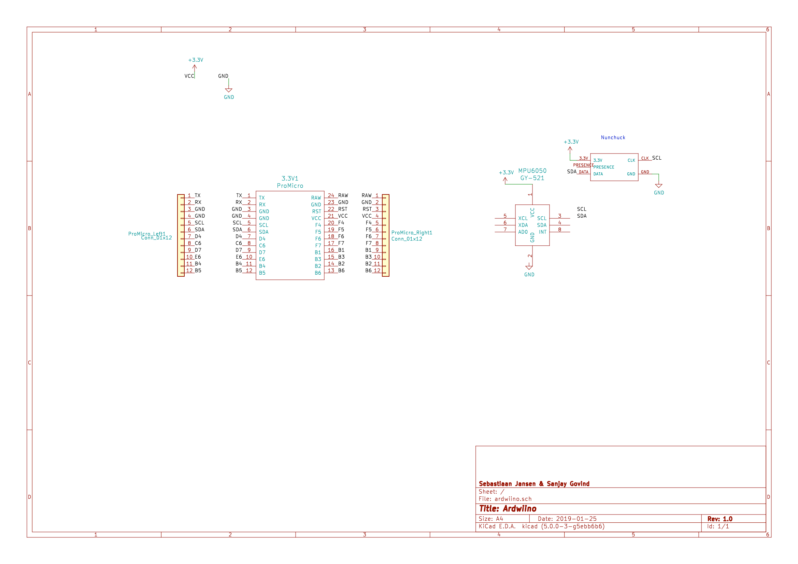

# Ardwiino

This project aims to provide a AVR solution that supports both direct and WII based guitar configurations. By editing config.h, you can set your guitar up with any configuration, and configure the wiring type, and also if you want to emulate xinput or a keyboard.

Note that xinput mode does not take care of xinput security, so your controllers will not work on a real xbox 360.

This repository contains code for both the uno, and the pro micro. It could very easily be modified to support many other AVR microcontrollers, as long as the AVR supports HID, either directly or via another AVR microcontroller (aka the uno).

# How to use this repo
## You will need:
1. An AVR microcontroller with USB hid compatibility and 3.3v compatibility (pro micro recommended)
2. A wii extension cable or breakout board
3. A MPU6050 or similar

## Flashing the software
1. Install an AVR toolchain + make
2. run `make uno` or `make micro`, depending on your microcontroller family 
3. For updates, hit + and - to jump to bootloader mode.

## Building the hardware
1. Find the I2C pins on your Arduino, and connect them to the extension / breakout board. Also connect ground to ground and 3.3v to 3.3v on the Arduino.
2. Connect your MPU6050 to the same pins. Note that the interrupt pin is not used in this sketch.
3. Use double sided tape to adhere the MPU6050 to the guitar. Note that the MPU6050 needs to be placed in a horizontal position during normal use.

## Used projects:
* https://github.com/bootsector/XInputPadMicro
* https://github.com/dmadison/NintendoExtensionCtrl
* https://github.com/abcminiuser/lufa/
