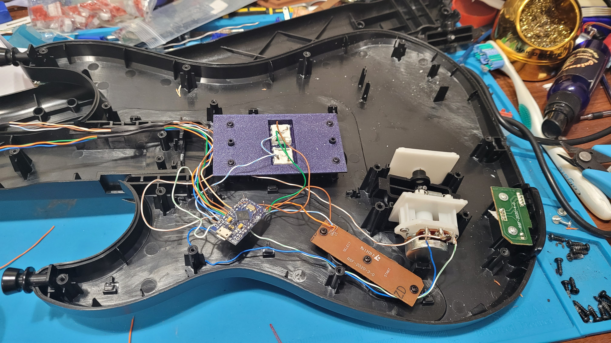
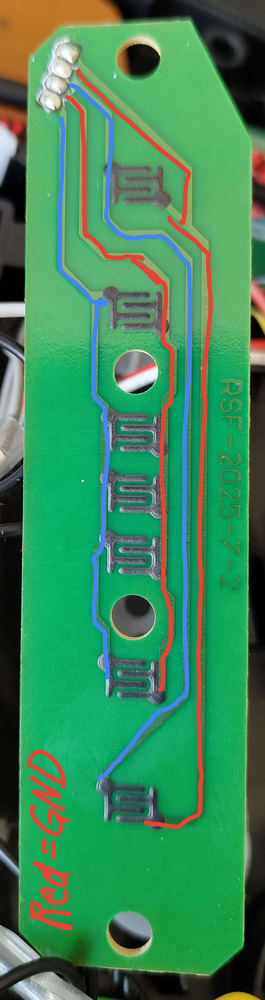
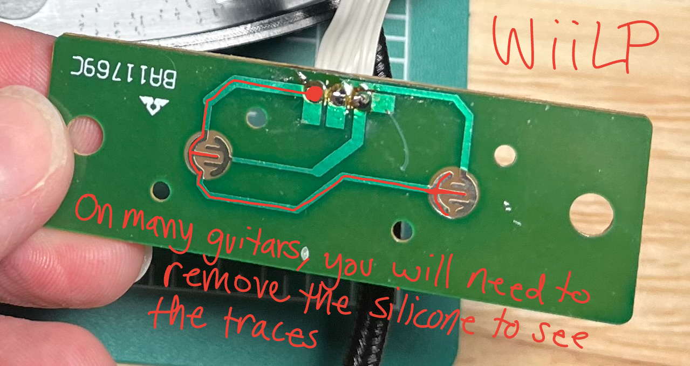
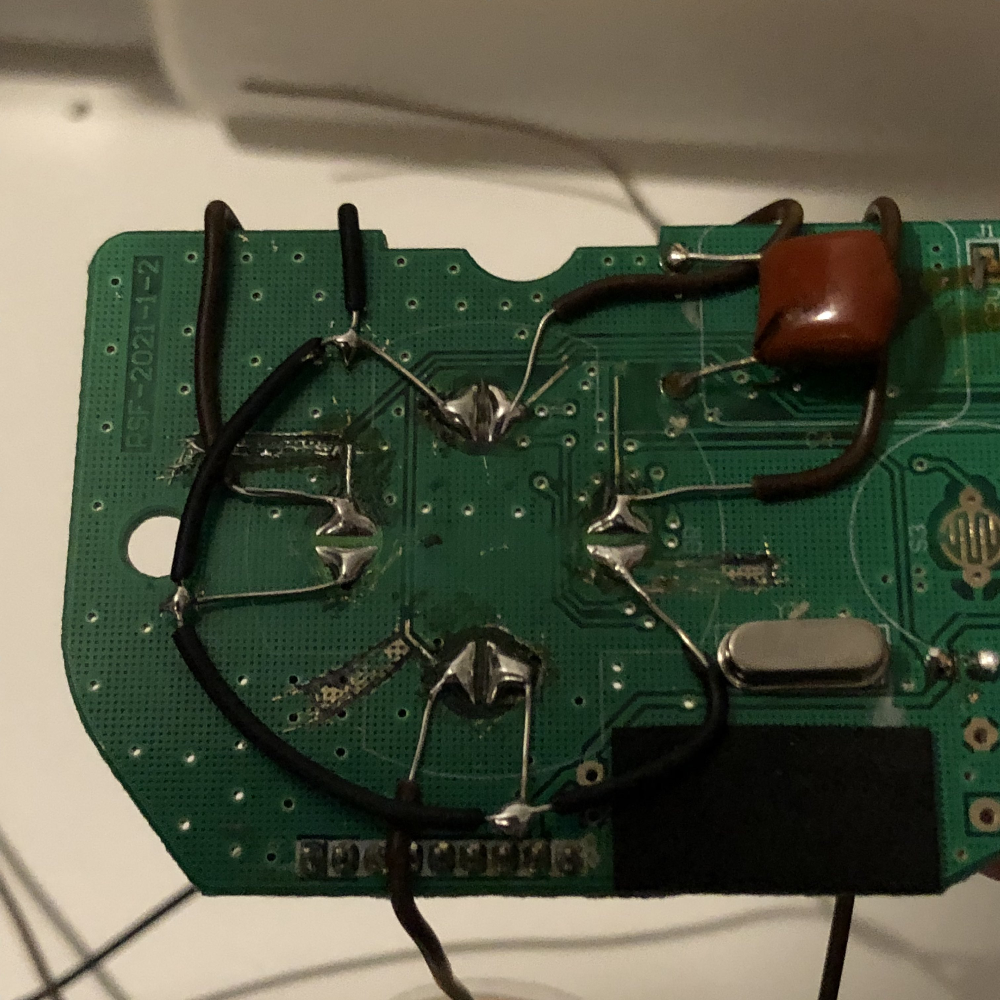
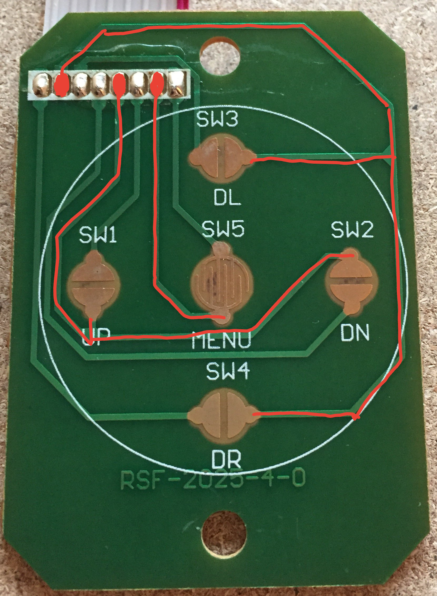
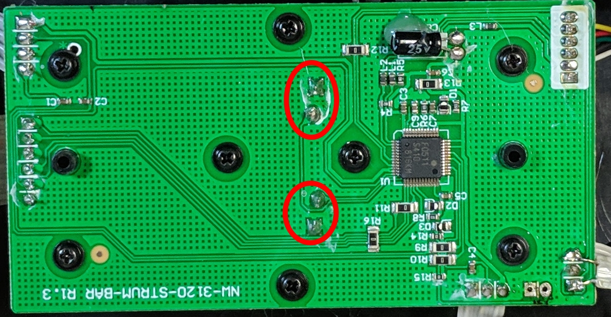
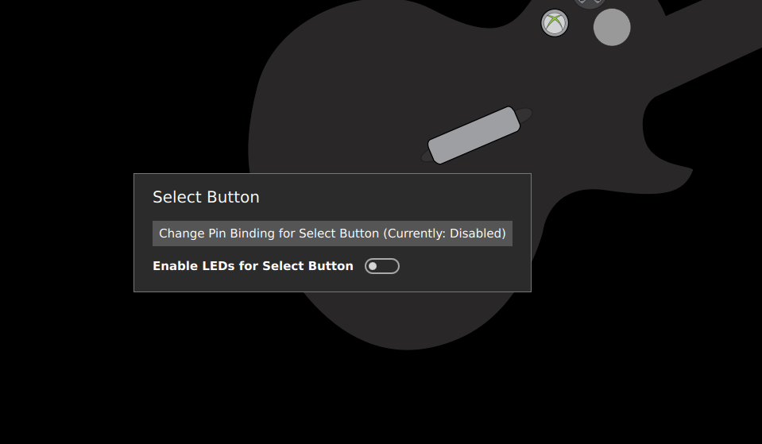

# Building a Directly Wired Controller
## Before you start:
This guide assumes that you know how to solder, if you do not stop now and go practice soldering.

If you have no idea what a microcontroller is, start here. If you are familiar with microcontrollers and pcbs skip ahead to the "Supplies" section. 

A microcontroller is a small board that can be programmed to perform various functions. In this guide you will be using the microcontroller to replace the main board of the guitar. Around the edge of the microcontroller, you will see various solder through holes called pins. These are labelled with a pinout (which you can find by googling {your microcontroller} pinout) and sometimes on the microcontroller itself. The pins have various functions, but for this controller mod you will need to be familiar with 4 kinds:
  * GND (ground) - the common connection that all electrical components must connect to in one way or another in order to complete the circuit. Every set of functions for the guitar will feature a GND pin.
  * VCC (voltage common connector) - this is where you would connect to provide power to a circuit. Sometimes this pin is labelled as 3.3V or 3v3 on the microcontroller or pinout.
  * Digital Pins - These pins are the "basic" pins. They can essentially only show if a button is pressed or not pressed. You will use these for strum, start/select and frets. The are the most common pin on your microcontroller and are usually labelled with just a number. 
  * Analogue Pins - These pins provide a range of values rather than just on and off. These are the pins you will need to use for whammy, tilt (when using an accelerometer), or your joystick. Analogue pins are labeled on the pinout with A followed by a number. 

 ```note
Analogue pins can be used as a digital pin, but digital pins CANNOT be used as an analogue pin. So if it the instructions say connect to a digital pin, you can use an analogue pin.
```
 ```note
VCC and GND can have more than one wire soldered to them. For example, if you want tilt and whammy but only have one VCC you can solder them both to the single VCC pin on the microcontroller.
```

 ```danger
note that on the pi pico you need to use the `3v3 out` pin (pin 36)  for your VCC, not 5V or `3v3_en`. The pins on the pico are not rated for 5v, and the `3v3_en` pin is actually an input that will stop your pico from starting.
```

If you are unfamiliar with microcontrollers, you may also be unfamiliar with PCBs in general and figuring out which pins correlate to which function. Here are some terms you will need to know. 
  * PCB (printed circuit board) - the often green or brown boards containing traces and electronic components
  * traces - the copper conductors on a board. They look flat and are often metalic. Think of them as "wires" on the board itself connecting components. If you are still confused, a quick google can help you understand traces.

## Supplies
* One of the following Microcontrollers:
  * Pi Pico (I recommend this the most, as it is the easiest to get started with and for most people it will be easier to purchase, and it runs at 3.3v so it works for everything.)
    * Note that in a future version, there will be some Pi pico only features, such as support for the WT Tap bar, and support for controller authentication passthrough, for XB1, retail XB360 and PS4.
  * Arduino Pro Micro (3.3v)
  * Arduino Pro Micro (5v)
  * Arduino Leonardo
  * Arduino Micro
  * Arduino Uno
  * Arduino Mega
```danger
  The arduino nano is NOT supported as it does not have the necessary hardware onboard for emulating a usb device. Some very very cheap arduino unos will also have this problem as they replace the programmable usb controller with a non programmable serial adapter. I don't recommend UNOs at all, but if your arduino uno mentions anything about a ch340g it won't work.
```
* A basic tilt switch (if you want tilt) (sometimes called a Mercury switch or ball tilt switch). 
  * Do NOT get a MPU-6050 as these no longer work.
  * It is recommended to use two, as this can help avoid accidental activations (this is what is done in some offical guitars)  
  * I know some people use the SW-520D (which is a ball tilt switch), I myself just use some mercury tilt sensors that my local electronics shop sells.
  * Make sure that you get a basic tilt sensor and not one with additional electronics, for example, this type of sensor is correct 
    
    [{: width="250" }](../assets/images/s-l500.jpg)
```danger
  You do not want to get this type of sensor, as it does not work. If you do accidentally get one of these you *might* have luck just cutting the sensor from the top of the board and using it, but your mileage may vary doing that, as I have seen it work for some people and not for others.
    
    [{: width="250" }](../assets/images/s-l500.png)
```
```danger
For anyone wanting to use tilt, the only supported methods are digital tilt and analog tilt sensors. Support for the MPU-6050 is removed. It causes a lot of issues for porting this code between various microcontrollers, and take up too much space in the firmware. It also has issues with lag, as it takes some time to be polled, and it is just in general not as responsive as a standard digital tilt sensor.
```
* Some Wire
* Soldering Iron
* Multimeter (it will be used mainly in continuity mode, where it beeps when the two contacts are shorted together)
* Wire Strippers
* Wire Cutters
* Heatshrink

```note
If you are unsure what microcontroller you want to use, click [{: width="250" }](https://sanjay900.github.io/guitar-configurator/guides/micro-controller-comparison.html) for a list of pros and cons about each microcontroller.
```

## The finished product
[{: width="250" }](../assets/images/direct.jpg)

```danger
Avoid pins 0 and 1 on the Arduino UNO, as these get used for sending controller information over USB. 
```

```danger
Be careful when programming an Arduino that has multiple variants. If you pick the wrong voltage, your device won't show up and you will need to follow the [{: width="250" }](https://sanjay900.github.io/guitar-configurator/tool/rescuing.html) instructions to make it show up again!
```

```danger
If you want to add APA102 LEDs to your guitar, avoid the MISO, MOSI and SCK pins on your Arduino.
   * For an Arduino Pro Micro (3.3v), Leonardo or Micro, the SCK pin is pin 15, the MOSI pin is pin 16 and the MISO pin is pin 14.
   * For an Arduino Uno, pin 11 is MOSI, pin 12 is MISO and pin 13 is SCK.
   * For an Arduino Mega, pin 51 is MOSI, pin 50 is MISO and pin 52 is SCK.
   * For a Pi Pico, GP3 is MOSI, GP4 is MISO and GP6 is SCK.
```

```note
Besides the above, it doesn't matter which pins you choose when wiring up your guitar, as the Config Tool will be configured later with the pins you use.
```

## Wiring Steps
For every function of the guitar, you will follow these same 3 basic steps. More details for specific functions will be given below.
1. Find out what each pin correlates to on the exsisting components in the guitar. (AKA work out the pinout) In some guitars, all of the pins are labeled on the main board or other various pcbs, sometimes on the bottom of the main board. 
2. Cut the wires away from the main board as close to the PCB as you can, giving yourself the most amount of wire that you can get. You may find however that the wire isn't long enough, in this case you can either join some more wire onto the end of the existing wires or you can desolder the cables and replace them.
3. Connect the wires to appropriate pins on the microcontroller. 

Once you have successfully modded one guitar (or even during your first) you will find it easiest to disconnect everything then begin soldering as it gives you more room to work. To keep the relevant information in this guide easy to find, information is sorted by function. 

## Start and Select

[{: width="250" }](../assets/images/360startselect.jpg)

[{: width="250" }](../assets/images/wiiLPstartselect.jpg)

1. If it is not labeled on the motherboard, you need to figure out which pin (or pins) is GND. If you remove the membrane, you will be able to see which pin connects to both start and select by following the traces - that pin is GND. (if there are multiple "grounds" they may be labeled as col, or column) Marking GND with a sharpie or using a differently colored wire is reccomended. If you are still unsure, the multimeter can help you confirm if you have the wires correct, as it will beep when you hit a button and have the correct wires. There are examples of the 360 WT and WiiLP above.
2. Connect the common ground to a GND on the microcontroller. If there are two ground wires, you can twist them together and put them in one ground pin on the microcontroller. This will sometimes be necessary when using a microcontroller that has a smaller number of pins.
3. Connect each button to an unused digital pin on the microcontroller. 

```note
To wire an xplorer start/select board you will have to solder directly to the contacts and cut the traces that connect to each contact. It is not reccomended you try to mod an xplorer as your first project because this can be difficult.
```

## Whammy
1. With most whammy's there are 3 pins. (if there are 4, you do not need the fourth. 2 pins is discussed below) The middle pin is the data pin, one outer pin is VCC while the other pin is GND (it doesn't matter which one, you can flip it when programming later if needed). Whammy needs to go to an analogue pin.
2. Connect VCC and GND to the microcontroller. (the two outside wires)
   * If your whammy is not responding correctly in game, you may need to swap VCC and GND around.
3. Connect the data (middle) pin to an analogue pin on the microcontroller. These are labeled with an A on the microcontroller.

If you are working on a controller with only "2" pins as shown below, you will need to desolder the bridged pins and run 3 wires yourself as noted above for the whammy to work best with the configurator.

[{: width="250" }](../assets/images/2wirewhammy.jpg)

## Tilt
1. Connect your tilt sensor to the microcontroller.
    * Connect the two switches in series between ground and any digital pin that has not already been used.

## Turntable or GH5 guitar neck
1. If you use one of the turntable emulation modes, or turn on gh5 neck support, then you can hook up VCC (marked as V or VCC) and GND (marked as GND or G), and then hook up the SCL (marked as CLK or C) and SDA (marked as Data or D) pins on the turntable or gh5 neck to your microcontroller.
   * For a Pi Pico, the SDA pin is GP18 and the SCL pin is GP19.
   * For an Arduino Pro Micro, Leonardo or Micro, the SDA pin is pin 2 and the SCL pin is pin 3.
   * For an Arduino Uno, pin A4 is SDA and A5 is SCL. Note that on newer arduinos, these pins are also available at the top of the board and are labeled SDA and SCL, but note that these are the same pins, so you can use either.
   * For an Arduino Mega, pin 20 is SDA and pin 21 is SCL.

## Joystick (or DPad)
For d-pads that are integrated with the main board it is advised you skip wiring the dpad as you have to solder directly to the contacts and run wires accross the board. You will either be able to use your keyboard for these buttons, or they really won't really be needed as the games were designed to be controlled with the guitar alone. Below is an example of what this can look like, and why it is advisable to skip.

[{: width="250" }](../assets/images/curseddpad.jpg)

For guitars with a DPad that is seperate, it will be much easier to wire as you can follow the traces and wire it to the pins like you would for start/select. 

[{: width="250" }](../assets/images/wtdpad.jpg)

   1. Find ground. There will be a single common ground and a pin for each direction or multiple "grounds" depending on the model. (some may once again be labeled as col or column) Just like for start and select, you will need to follow the traces to figure out which pin is GND. Mark GND, then connect it to a GND pin on the microcontroller. If there are more than one ground wires, you can twist them together and combine them again.
   2. Up and down on the dpad MUST be connected to the same pins you will be using for strum. You will want to twist those wires together and solder them to the same pin. You may want to wait until you are working on the strum to connect these pins.
   3. Home, left, and right can be connected to any unused digital pin on the microcontroller. 

For guitars with a joystick, there will be four pins, one is VCC, one is GND, one is the x axis and one is the y axis. You can work out which is which by tracing the traces, however on some guitars the traces are labelled for you. The joystick needs to go to an analogue pin (one of the A pins)


## Frets
1. For the frets, if it is not labeled it is easiest to open up the neck and follow the traces between the fret contacts. The ground wire traces will connect to all of the fret contacts, whereas a fret trace will lead to a single fret contact. At the end of this guide, there are some images for known neck pinouts. If using the multimeter, test between the fret wire and the ground wire, and the multimeter should beep when the fret is pressed.
2. Connect the common grounds to a ground pin on the microcontroller.
3. Connect each fret to its own unused digital pin. 

## Strum
   The Strum switches are similar to the start and select buttons, they will be three wires on some guitars. For these situations it is easy enough to connect to the microcontroller.
   
   1. Connect Strum
   2.  Connect the common ground to a GND on the microcontroller.
   3.  Connect each strum switch to an unused digital or analogue pin on the microcontroller.

   On others, the Strum switches are a part of the main PCB, and you will need to solder directly to the strum switches, which should poke out the back of the main PCB. For example, on a wiitar, you will see the following: 

   [{: width="250" }](../assets/images/wii-strum.jpg)
   
   In this case, there are two grounds that will be shorted together, so with the multimeter, you should be able to work out which pins are ground, by testing a pin from each switch, and working out which ones are shorted together by it beeping.
   
   Note that you can also choose to replace the original PCB with a 3D printed strum switch holder. If you want to go that route, there are some designs around for various guitars. The image at the beginning of this guide shows how this would look.
   
   When the strums are part of the main board you will need to cut the traces or you will have phantom inputs as your signal will still be traveling through the motherboard. (this is when your strum switches constantly input and you likely cannot autobind inputs in the configurator) You will need to take a knife and cut any traces that connect to the strum switches. In the picture below, the person did not cut many traces as they knew which ones were causing phantom inputs. Cutting extra traces is not going to affect your arduino guitar, as none of the traces are used accept the one that connects the two grounds of the switches together. Even if you accidentally cut that trace, you will be able to connect the grounds again with a little extra wire.

  [{: width="250" }](../assets/images/trace%20cuts.jpg)

## Using the Ardwiino Configuration Tool
1. Start the Ardwiino Configuration Tool
   1. Note if you are on linux, you may need to follow the steps outlined in the  instructions
2. Plug in your Arduino / Pico
3. Your Arduino should show up, like in the following image.

    [{: width="250" }](../assets/images/device-pick-uno.png)
    * Using a Pico and don't see your device? Unplug the pico, hold the bootsel button, and plug it back in.
    * If your Pico is NOT an offical pi pico, you may need to use the KB2040 if your pico board is not listed, as the offical pi pico firmware is strict on its support and may not work with your hardware. If you find that you are unable to use your pico after unplugging and replugging it, this is the problem.
    
    [{: width="250" }](../assets/images/pico-bootsel.png)

4. Click Continue
5. You will be met with the following screen (Note that it will be slightly different for an Arduino Uno or Arduino Mega)

    [{: width="250" }](../assets/images/programming.png)

6. For the Micro, Leonardo and Pro Micro, please pick the type of device you have in the dropdown. Note that you need to get the voltage right, otherwise your device will not work and will need to be reset.
7. Click `Start programming` and wait for it to program

 ```note
If you are on linux and can't proceed past this step, follow these instructions: https://github.com/sanjay900/guitar-configurator/issues/32
```   
9. Once it finishes, Click `Start Configuring`
10. You will be taken to following the configuration screen.

    [{: width="250" }](../assets/images/main-screen-graphical.png)

10. Click on `Change Device Settings`.
11. You will be shown the following dialog:

    [{: width="250" }](../assets/images/change-dialog.png)

12. Change `Controller Connectivity Type` to Direct.
    * You can also change the `Controller Output Type` here too if you would like to emulate a different type of controller, such as a drum set, a standard controller or even a controller for a different console, like a PS3 or a Switch.
    * Optionally, enable and configure Queue based inputs. This uncaps the scanning rate on the buttons of the controller, logging all the button changes to an internal list. The game then receives the next recorded input in the list instead of the immediate button state, which would usually be capped to the Controller Poll Rate. This emulates a higher polling rate (even above 1000 Hz!) even with low in-game FPS, which is extremely useful in games such as Clone Hero. Adjust the Dequeue Rate to be as close to, but still below your expected worst case in-game FPS for the system to work properly.
13. If you would like the Left Joystick (The only Joystick on a Wii Guitar) to act like the DPad, then enable `Map Left Joystick to DPad`
14. If you would like to emulate the Home button by hitting both Start and Select at the same time, then enable `Map Start + Select to Home`
15. Hit Close
16. If you want to enable Tilt, click on Configure Tilt
    1.  The following dialog will appear
      
        [{: width="250" }](../assets/images/tilt-dialog.png)

    2. Set the Tilt Sensor Type to Digital
    4. Click on the button underneath Pin Binding.
    5. The Pin Configuration Dialog will appear:

       [{: width="250" }](../assets/images/pin-dialog.png)

    6. You can either click on the pin that you have plugged your tilt into, or use the `Automatically Find Pin Binding` button. You can then just tilt the guitar to activate tilt. 
    7. Click `Apply Changes`
    8. Click `Close`
 1. You should now be back at the main screen. You have two options for configuring pins, list view and graphical view, you are currently in graphical view.
    1. If you want to use graphical view (its easier to use but slower)
       1. From here, you can hover over buttons to configure them. You will be presented with the folowing dialog:
    
            [{: width="250" }](../assets/images/select-hover.png)
       2. Click on 'Change Pin Binding' button. You will then be presented with the pin configuration dialog
       3. You can either click on the pin that you have plugged the input you are configuring into, or use the `Automatically Find Pin Binding` button. You can then just press the button you are configuring or for whammy or joystick, just move the whammy or joystick. 
    2. If you want to use list view, click the list view button at the bottom of the screen
       1. In list view, you are just presented with a list of all of the possible bindings. You can just click on the `Pin Binding` button for each input you want to bind, and you will be taken directly to the pin configuration dialog.
       2. You can either click on the pin that you have plugged the input you are configuring into, or use the `Automatically Find Pin Binding` button. You can then just press the button you are configuring or for whammy or joystick, just move the whammy or joystick. 
 2.  Click `Write`
 3.  At this point, your controller should be working, test it using the Windows controller tester or a game controller tester of your choice.
