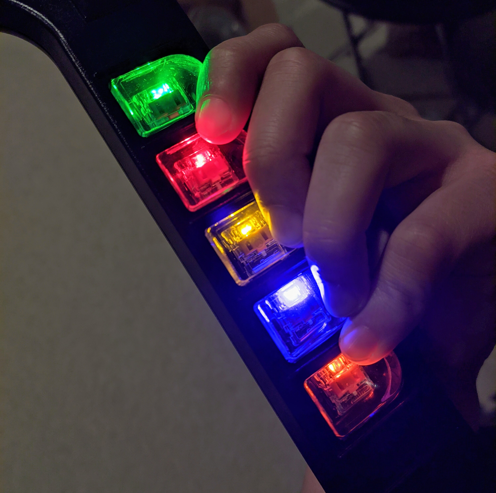
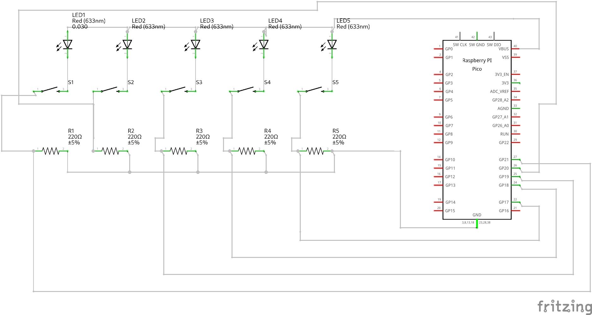

# Adding Standard LEDs inline on a controller
If you want to avoid the trouble of using APA102s, and just want to hook up normal LEDs from buttons, you can follow the following guide.
## You will need
* A Directly wired controller
* Some LEDs
* a 500 ohm resistor for each led

## The finished product
[{: width="250" }](../assets/images/inline-led.jpg)

## Schematic
[{: width="250" }](../assets/images/led.png)

Note that you can use whatever pins you want as your digital pins, this is just for example

## Steps
1. Hook all the anodes of the LEDs to the 5V pin on your microcontroller (note that for the pi pico, this is VBUS).
2. Hook up the cathodes of the LEDs to one side of each fret
3. Hook the other side of the fret up to a digital pin on your microcontroller
4. Hook up a 500 ohm resistor in parallel between each digital pin and ground. You should have two connections to each digital pin, one going to the fret, and one going to a resistor that then goes to ground.
5. Open the Config Tool and find your device, then click continue
6. Click on Configure LEDs
7. Set the LED type to Inline
8. Click on Close
9. Click on Write
