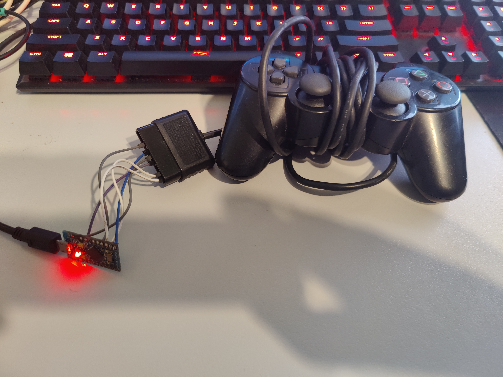

The Ardwiino Guitar Configurator tool allows you to program Arduinos for your own custom controllers.

[{: width="250" }](assets/images/main-screen-graphical.png)

# Features
* Controllers can emulate a variety of different controllers, including XInput, PS3, Nintendo Wii Rockband Controllers, PS4/PS5 Rockband Controllers and even a Nintendo Switch Pro Controller
* Controllers can either take input from to Wii controllers, take input from to PS2 controllers or the inputs can be wired directly to the Arduino
* Controllers poll at <1ms, but due to the limitations of USB 2.0, this will result in a poll rate of 1ms
* Controllers support having LEDs react to inputs, including using APA102s (Dotstar) or just wiring regular LEDs inline with the buttons.
* An Arduino Pro Micro, Arduino Micro, Arduino Leonardo, Arduino Uno or Arduino Mega can be used.
* Tool is cross platform, with LED support working on Linux, macOS and Windows.
* Star Power tilt support for Guitar Hero Guitars with mercury switches or other tilt switches

```note
Avoid using USB 2.0 hubs when using these controllers, they poll so quickly that multiple guitars on a single hub will be slowed down, and some hubs will even cause issues with the controller being detected. However, USB 3.0 hubs are okay, and I have previously used multiple guitars on a single USB 3.0 hub with no issues.
```

# X360 Support
You can use [UsbdSecPatch](https://github.com/InvoxiPlayGames/UsbdSecPatch/releases) to patch out the authentication checks on an RGH modded console, and then you can use an Ardwiino controller on X360.

## Instructions:
1. Mod your console and install dashlaunch
2. Copy the xex file from above to your console
3. Add it as a plugin to dashlaunch
4. Unplugin your controller, and plug it in AFTER the boot animation.

# PS2 Support
You can use [the latest build of OpenPS2Loader](https://github.com/ps2homebrew/Open-PS2-Loader/releases) to allow using PS3 guitars on a modded PS2. If you enable PADEMU it should recognise your guitar and allow you to play games, as long as you have your guitar configured for PS3 mode. Both PS3 GH and RB guitars are supported.

## Instructions:
1. Mod your console and install dashlaunch
2. Copy the xex file from above to your console
3. Add it as a plugin to dashlaunch
4. Unplugin your controller, and plug it in AFTER the boot animation.

# How to build an adaptor or controller
Pick a guide from the left to learn how to build a controller or adaptor.

# Need Help? Something not working?
Feel free to message me on Discord, my username is sanjay900#0001.

# Download link
Click [{: width="250" }](https://github.com/sanjay900/guitar-configurator/releases/latest) to download. You can visit [{: width="250" }](https://github.com/sanjay900/guitar-configurator/releases) in order to see older releases and testing releases.

# Gallery





<!-- 
We can do this, but currently it isnt useful as we dont have proper descriptions
# Changelog

  * [{: width="250" }]({{ release.html_url }})
 -->

# Donate Link
I have put several years of development time into this project, if you like it feel free to support this project by clicking the below link:

