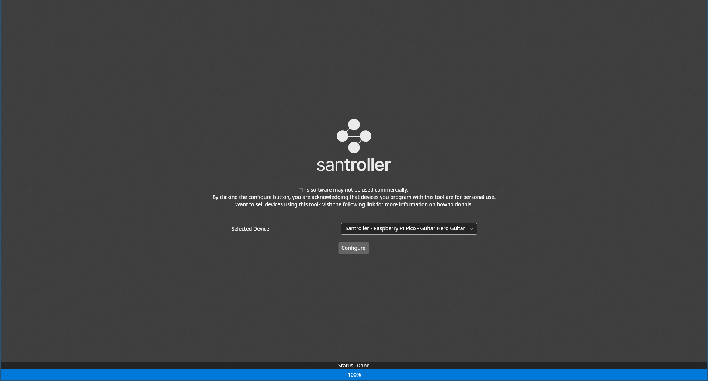
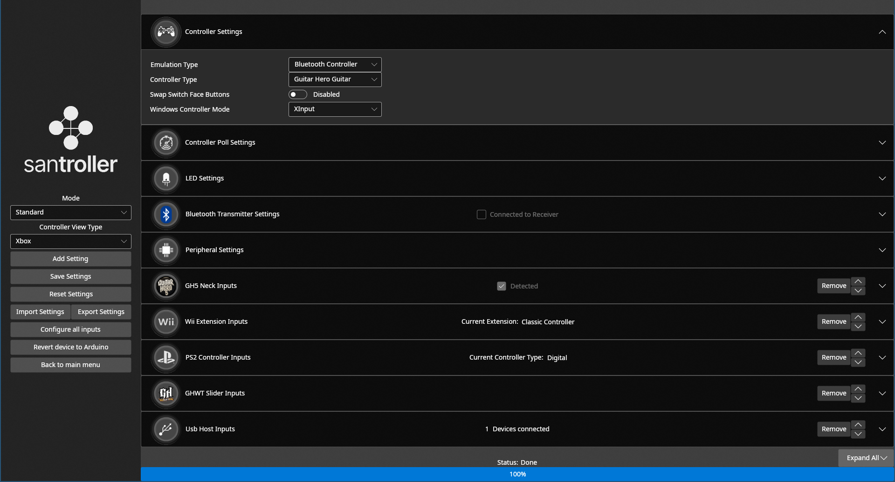

The Santroller platform provides the ability to program micro controllers that emulate various rhythm game controllers for computers and various consoles.
This is done using the Santroller Configurator, which can program various microcontrollers to emulate different controllers.

# Gallery

[](assets/images/screenshots/home.png)
[](assets/images/screenshots/main.png)
[](assets/images/screenshots/combined.png)
[](assets/images/adaptor.jpg)
[](assets/images/adaptor-ps2.jpg)
[](assets/images/direct.jpg)
[](assets/images/inline-led.jpg)

# Features

- Support for various consoles, including PS2/3/4/5, Wii, Switch, Xbox 360 and Xbox One / Series

  | Controller Type                        | Game                              | PC                                                      | PS2                                                                                                                                                                                                    | PS3            | PS4                                                                                            | PS5                                                                                            | Xbox 360                                                                                                                                                                                           | Xbox One / Series                                                                              | Wii / Wii U                                                                                                                                                                        | Switch                                                                                      |
  | -------------------------------------- | --------------------------------- | ------------------------------------------------------- | ------------------------------------------------------------------------------------------------------------------------------------------------------------------------------------------------------ | -------------- | ---------------------------------------------------------------------------------------------- | ---------------------------------------------------------------------------------------------- | -------------------------------------------------------------------------------------------------------------------------------------------------------------------------------------------------- | ---------------------------------------------------------------------------------------------- | ---------------------------------------------------------------------------------------------------------------------------------------------------------------------------------- | ------------------------------------------------------------------------------------------- |
  | Gamepad                                | Any                               | Works natively                                          | Requires [PS2 Controller emulation](https://santroller.tangentmc.net/wiring_guides/ps2_output.html) or a Modded PS2 + [nightly build of OPL](https://santroller.tangentmc.net/console_guides/ps2.html) | Works natively | Requires [authentication](https://santroller.tangentmc.net/console_guides/authentication.html) | Requires [authentication](https://santroller.tangentmc.net/console_guides/authentication.html) | Requires [authentication](https://santroller.tangentmc.net/console_guides/authentication.html) or [UsbdSecPatch](https://santroller.tangentmc.net/console_guides/authentication.html#usbdsecpatch) | Requires [authentication](https://santroller.tangentmc.net/console_guides/authentication.html) | Requires [santroller-bslug](https://santroller.tangentmc.net/console_guides/wii.html) or [Wii Extension Emulation](https://santroller.tangentmc.net/wiring_guides/wii_output.html) | Works (The switch will always use gamepad mode, no matter what controller mode is selected) |
  | Guitar Hero Guitar                     | Guitar Hero 2                     | Works natively                                          | Requires [PS2 Controller emulation](https://santroller.tangentmc.net/wiring_guides/ps2_output.html) or a Modded PS2 + [nightly build of OPL](https://santroller.tangentmc.net/console_guides/ps2.html) |                |                                                                                                |                                                                                                | Requires [authentication](https://santroller.tangentmc.net/console_guides/authentication.html) or [UsbdSecPatch](https://santroller.tangentmc.net/console_guides/authentication.html#usbdsecpatch) |                                                                                                |                                                                                                                                                                                    |                                                                                             |
  | Guitar Hero Guitar                     | Guitar Hero 3                     | Works natively                                          | Requires [PS2 Controller emulation](https://santroller.tangentmc.net/wiring_guides/ps2_output.html) or a Modded PS2 + [nightly build of OPL](https://santroller.tangentmc.net/console_guides/ps2.html) | Works natively |                                                                                                |                                                                                                | Requires [authentication](https://santroller.tangentmc.net/console_guides/authentication.html) or [UsbdSecPatch](https://santroller.tangentmc.net/console_guides/authentication.html#usbdsecpatch) |                                                                                                | Requires [santroller-bslug](https://santroller.tangentmc.net/console_guides/wii.html) or [Wii Extension Emulation](https://santroller.tangentmc.net/wiring_guides/wii_output.html) |                                                                                             |
  | Guitar Hero Guitar / Guitar Hero Drums | Guitar Hero WT or newer           | Works natively                                          | Works natively                                                                                                                                                                                         | Works natively |                                                                                                |                                                                                                | Requires [authentication](https://santroller.tangentmc.net/console_guides/authentication.html) or [UsbdSecPatch](https://santroller.tangentmc.net/console_guides/authentication.html#usbdsecpatch) |                                                                                                | Requires [santroller-bslug](https://santroller.tangentmc.net/console_guides/wii.html) or [Wii Extension Emulation](https://santroller.tangentmc.net/wiring_guides/wii_output.html) |                                                                                             |
  | Rock Band Guitar / Rock Band Drums     | Rock Band (All Games)             | Works natively                                          | Works natively                                                                                                                                                                                         | Works natively | Works via PS3 instrument backwards compatibility                                               | Works via PS3 instrument backwards compatibility                                               | Requires [authentication](https://santroller.tangentmc.net/console_guides/authentication.html) or [UsbdSecPatch](https://santroller.tangentmc.net/console_guides/authentication.html#usbdsecpatch) | Requires [authentication](https://santroller.tangentmc.net/console_guides/authentication.html) | Works natively                                                                                                                                                                     |                                                                                             |
  | Rock Band Pro Keys                     | Rock Band 3                       | Works natively                                          |                                                                                                                                                                                                        | Works natively |                                                                                                |                                                                                                | Requires [authentication](https://santroller.tangentmc.net/console_guides/authentication.html) or [UsbdSecPatch](https://santroller.tangentmc.net/console_guides/authentication.html#usbdsecpatch) |                                                                                                | Works natively                                                                                                                                                                     |                                                                                             |
  | Guitar Hero Live Guitar                | Guitar Hero Live                  | Works natively                                          |                                                                                                                                                                                                        | Works natively | Requires [authentication](https://santroller.tangentmc.net/console_guides/authentication.html) | Requires [authentication](https://santroller.tangentmc.net/console_guides/authentication.html) | Requires [authentication](https://santroller.tangentmc.net/console_guides/authentication.html) or [UsbdSecPatch](https://santroller.tangentmc.net/console_guides/authentication.html#usbdsecpatch) | Requires [authentication](https://santroller.tangentmc.net/console_guides/authentication.html) | Works natively                                                                                                                                                                     |                                                                                             |
  | DJ Hero Turntable                      | DJ Hero                           | Works natively                                          | Works natively                                                                                                                                                                                         | Works natively |                                                                                                |                                                                                                | Requires [authentication](https://santroller.tangentmc.net/console_guides/authentication.html) or [UsbdSecPatch](https://santroller.tangentmc.net/console_guides/authentication.html#usbdsecpatch) |                                                                                                | [Wii Extension Emulation](https://santroller.tangentmc.net/wiring_guides/wii_output.html). santroller-bslug support is being worked on but does not currently work.                |                                                                                             |
  | Rock Band Stage Kit                    | Rock Band (All Games)             | Works natively                                          |                                                                                                                                                                                                        |                |                                                                                                |                                                                                                | Requires [authentication](https://santroller.tangentmc.net/console_guides/authentication.html) or [UsbdSecPatch](https://santroller.tangentmc.net/console_guides/authentication.html#usbdsecpatch) |                                                                                                |                                                                                                                                                                                    |                                                                                             |
  | Guitar / Drums                         | Fortnite Festival Standard Mode   | Works natively                                          |                                                                                                                                                                                                        |                | Works natively, though you need to set the NKRO type to 6KRO                                   | Works natively, though you need to set the NKRO type to 6KRO                                   |                                                                                                                                                                                                    | Works natively                                                                                 |                                                                                                                                                                                    | Works natively                                                                              |
  | Rock Band Guitar / Rock Band Drums     | Fortnite Festival Instrument Mode | Requires setting up a Console Mode Binding for Festival |                                                                                                                                                                                                        |                | Requires setting up a Console Mode Binding for Festival                                        | Requires setting up a Console Mode Binding for Festival                                        |                                                                                                                                                                                                    | Requires setting up a Console Mode Binding for Festival                                        |                                                                                                                                                                                    | Works natively (though you will need to bind buttons from the game.)                        |

- Ability to emulate the following devices
  - Guitar Hero Guitars
  - Rock Band Guitars
  - Guitar Hero Drums
  - Rock Band Drums
  - Rock Band Pro Drums
  - Guitar Hero Live Guitars
  - DJ Hero Turntables
  - Rock Band Stage Kit
  - Standard Gamepad
  - Guitar Praise Guitar
  - Rock Band Pro Keys
  - Fortnite Festival
    - Uses Keyboard mode under the hood, but simplifies the binding process
    - Supports a emulated strum mode that requires both fret inputs and strum inputs to register an input
    - Works on console, use 6KRO mode for the PS4 and PS5
  - Fortnite Festival (Pro Mode)
    - Uses Keyboard mode under the hood, but simplifies the binding process
    - There is also support for emulating a riffmaster on Windows, but whammy will not work
    - Added alongside normal bindings, so you can use a guitar normally with games and then hold a button to go into instrument mode.
  - Keyboard
    - NKRO (N-key Rollover)
      - No ghosting, works on most devices
    - 6KRO (6-Key Rollover)
      - Only 6 keys can be used simultaneously, required for PS4 and PS5
  - PS2 controllers
  - PS2 guitars
  - Wii classic controller
  - Wii guitar hero guitar
  - Wii guitar hero drums
  - Wii DJ Hero Turntable
- Lower latency in comparison to the older Guitar Configurator firmware
- Inputs update live while configuring, to make calibration and testing as easy as possible.
- Controllers automatically detect what they are plugged into, and reconfigure themselves for that device.
  - This means you no longer need to set your controller up for a specific console.
  - For emulators, you can define button combinations that will force the device into a specific mode.
  - For RPCS3, starting a game will jump the controller to PS3 mode, and then you can restart the game to actually detect the controller, as RPCS3 does not have hotplug support. This will also automatically enable WinUSB on windows as well.
- Support for presets
  - Store several configuration presets and easily swap between them
  - Export and import configurations as files for easy sharing of configurations
- Support for all major operating systems
  - Setting a guitar to XInput mode will only use XInput mode on windows
  - Using HID mode by default means the controller should work on any device, as HID devices are supported by most operating systems and non console devices.
- Support for various microcontrollers
  - Pi Pico **Recommended**
    - Some features such as USB inputs and peripheral are Pi Pico only
    - The Pico also has a much more robust programming method, so there is less that can go wrong when programming
  - Arduino Pro Micro (3.3v)
  - Arduino Pro Micro (5v)
  - Arduino Leonardo
  - Arduino Micro
  - Arduino Uno R1/2/3
  - Arduino Mega
- Support for inputs from various input sources
  - Wii extensions (such as wii guitars, classic controllers or drum kits)
  - PS2 controllers
  - Instrument peripherals
    - WT Tap bar
    - GH5 Guitar neck
    - DJ Hero Turntable platter
    - Digital and analog tilt sensors
    - Crazy Guitar neck
  - Secondary Peripheral inputs (Pi Pico only)
    - This allows for receiving inputs from a secondary Pi Pico, to make wiring things like GH5 guitar necks or DJ hero turntables easier
    - LEDs can also be controlled over this interface
  - USB devices (Pi Pico only)
    - This is also how authentication works, it gets passed through to an offical USB controller
    - Works with both game controllers, MIDI devices, keyboards and mice
  - Direct wiring to digital or analog sources
  - MPR121
    - This is a capacative touch chip that can handle both the slider bar and frets over I2C, much like how the GH5 guitar neck works
    - However, it has the same latency as direct wiring
  - ADXL345
    - Can be used as a tilt sensor and mapped to any axis
- Support for bluetooth (Pi Pico W required)
  - Supports both conecting to a bluetooth receiver directly, or building a bluetooth receiver from a second Pico W
  - Using a second Pico W allows for using the receiver on a device that doesn't support bluetooth gamepads directly, such as a console
- Custom input mappings
  - You can map inputs from _any_ controller to _any_ output. This means you can do things like mapping a button press on a Wii guitar to tilt.
  - This also lets you do things like mapping a button press to a tap bar fret or the pickup selector on a Rock Band guitar
- Shortcuts
  - Replaces the previous hardcoded start + select to home feature, and allows for defining any combination of inputs and mapping that to an output.
  - The inputs do need to be of the same type however, so this means you can do things like requiring multiple digital inputs, but not an analog + a digital input
  - You can even use this feature for tap bar frets or the pickup selector. This can be useful if your are using an actual selector switch for your pickup selector, instead of a potentiometer.
- Constant inputs
  - This can be used to force an output to always be set to a specific value, such as forcing a specific pickup selector value if you don't have a pickup selector attached
- Peripheral Mode (Pi Pico only)
  - Use a second Pi Pico for inputs or LEDs, and then connect only a few wires between the two microcontrollers.
  - This can be used to put LEDs in a DJ Hero turntable, or to bypass the GH5 neck's microcontroller but keep it removable.
- Overhauled LED support
  - Player LED support
    - PS3/4/5 and Xbox 360
  - LED indicator for console authentication
  - Rumble (in gamepad mode)
  - PS4 LED support
  - Stage Kit LED and Fog machine support
  - LEDs that react to game events
    - Currently, the only supported game for this is the latest YARG nightly.
    - CH support isn't planned, as there is not an easy way to hook into it. Older tools used hacks to inject themselves into the game, but this method was not stable and wouldn't work for ScoreSpy.

```note
Avoid using USB 2.0 hubs when using these controllers, they poll so quickly that multiple guitars on a single hub will be slowed down, and some hubs will even cause issues with the controller being detected. However, USB 3.0 hubs are okay, and I have previously used multiple guitars on a single USB 3.0 hub with no issues.
```

# How to build an adaptor or controller

Pick a guide from the left to learn how to build a controller or adaptor.

# Need Help? Something not working?

Click [here](http://discord.gg/CmdYpXKcEU) to join the discord, and someone should be able to help you with your problem.

# Download link

Click [here](https://github.com/Santroller/Santroller/releases/latest) to download the configuration tool.

# Using this tool commercially

If you would like to sell devices running the Santroller firmware, click the [following link](https://santroller.tangentmc.net/tool/commercial_use.html) to learn more about the commercial version of this platform.
The standard version of this tool can NOT be used commercially, and the commercial version of this platform has extra features that are designed specifically for users who are selling products running on this platform.

# Donate Link

I have put several years of development time into this project, if you like it feel free to support this project by clicking the below link:


# Current Sponsors

<div class="sponsors">
<!-- sponsors --><a href="https://github.com/Katana-AS"></a><a href="https://github.com/The760"></a><a href="https://github.com/DeathByTaunt666"></a><a href="https://github.com/yazz-flutist"></a><a href="https://github.com/ereid129"></a><a href="https://github.com/mnkhouri"></a><a href="https://github.com/Amos343"></a><a href="https://github.com/HondySondy"></a><a href="https://github.com/RetroCult"></a><a href="https://github.com/Spyr02990"></a><a href="https://github.com/HutchMD"></a><a href="https://github.com/GrimmRetro"></a><a href="https://github.com/afaelr"></a><a href="https://github.com/Svartkattt"></a><a href="https://github.com/TerpyCustoms"></a><a href="https://github.com/stephgh1"></a><a href="https://github.com/weirdo68"></a><a href="https://github.com/LTJPunkass"></a><a href="https://github.com/JamesF302"></a><a href="https://github.com/m2torres97"></a><a href="https://github.com/TheFatBastid"></a><a href="https://github.com/View300"></a><a href="https://github.com/AngelCustomsCH"></a><a href="https://github.com/FauxFretworks"></a><a href="https://github.com/mtolly"></a><a href="https://github.com/am-chris"></a><a href="https://github.com/InvoxiPlayGames"></a><a href="https://github.com/HeuristicBishop"></a><a href="https://github.com/Pixelholic"></a><a href="https://github.com/Partyboi"></a><a href="https://github.com/slugnificent"></a><a href="https://github.com/baddlywaxxed"></a><a href="https://github.com/RobThePCGuy"></a><a href="https://github.com/mpw1979"></a><a href="https://github.com/shockdude"></a><!-- sponsors -->
</div>
