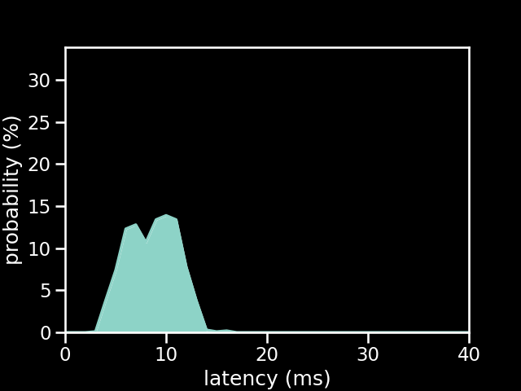

# PS1 controller via bluetooth between two Pi Picos

| Metric          | Value          |
| --------------- | -------------- |
| firmware        | new            |
| microcontroller | Pi Pico        |
| communication   | Bluetooth      |
| controller      | PS1 Controller |
| poll rate       | 1 ms           |
| min             | 3.96 ms        |
| max             | 16.95 ms       |
| avg             | 9.07 ms        |
| stddev          | 2.42 ms        |
| %on time        | 46%            |
| %1f skip        | 54%            |
| %2f skip        | 0%             |
| %3f skip        | 0%             |

[{: class="big-image" }](../../assets/images/results/santroller_bt_ps1_n.png)
