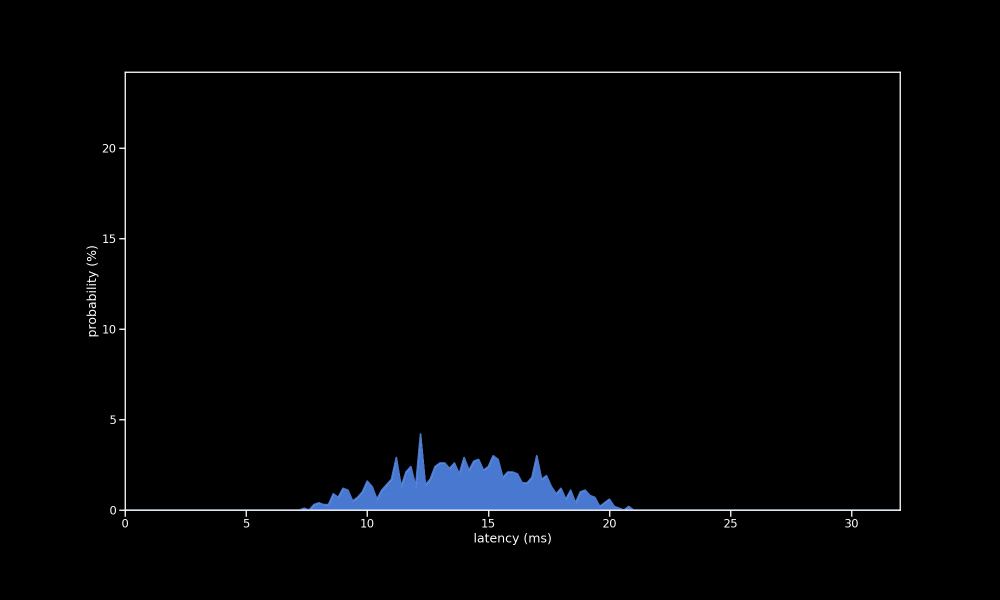

# PS2 SG

| Metric          | Value     |
| --------------- | --------- |
| firmware        | new       |
| microcontroller | Pi Pico   |
| communication   | Bluetooth |
| controller      | PS2 SG    |
| poll rate       | 1 ms      |
| min             | 7.56 ms   |
| max             | 20.96 ms  |
| avg             | 14.11 ms  |
| stddev          | 2.78 ms   |
| %on time        | 16%       |
| %1f skip        | 82%       |
| %2f skip        | 2%        |
| %3f skip        | 0%        |

[{: class="big-image" }](../../assets/images/results/santroller_bt_ps2_guitar_n.png)
