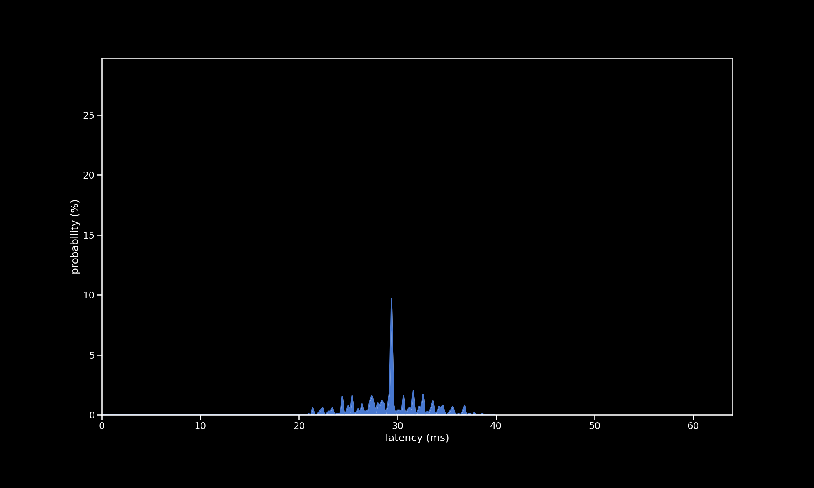

# DJ Hero Turntable (10ms)

| Metric              | Value                     |
| ------------------- | ------------------------- |
| firmware            | new                       |
| microcontroller     | Pi Pico                   |
| controller          | DJ Hero Turntable Platter |
| turntable poll rate | 10 ms                     |
| poll rate           | 1 ms                      |
| min                 | 21.03 ms                  |
| max                 | 61.29 ms                  |
| avg                 | 40.53 ms                  |
| stddev              | 11.58 ms                  |
| %on time            | 0%                        |
| %1f skip            | 11%                       |
| %2f skip            | 42%                       |
| %3f skip            | 4642%                     |

[{: class="big-image" }](../../assets/images/results/santroller_dj_10.png)
