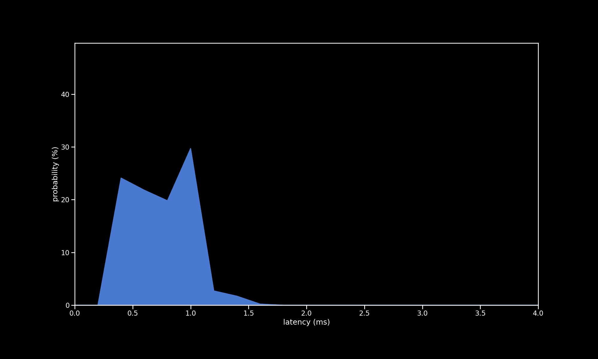

# Pi Pico used as Peripheral connected to Pi Pico

| Metric           | Value                      |
| ---------------- | -------------------------- |
| firmware         | new                        |
| microcontroller  | Pi Pico                    |
| controller       | Pi Pico in Peripheral mode |
| peripheral input | direct                     |
| poll rate        | 1 ms                       |
| min              | 0.48 ms                    |
| max              | 2.19 ms                    |
| avg              | 1.03 ms                    |
| stddev           | 0.43 ms                    |
| %on time         | 95%                        |
| %1f skip         | 5%                         |
| %2f skip         | 0%                         |
| %3f skip         | 0%                         |

[{: class="big-image" }](../../assets/images/results/santroller_peripheral_n.png)
