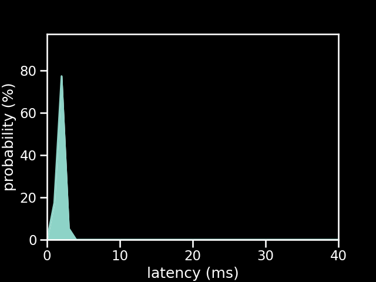

# PS1 Controller connected to a Pro Micro 5v running the old firmware

| Metric          | Value          |
| --------------- | -------------- |
| firmware        | old            |
| microcontroller | Pro Micro 5v   |
| controller      | PS1 Controller |
| poll rate       | 1 ms           |
| min             | 1.1 ms         |
| max             | 3.23 ms        |
| avg             | 2.34 ms        |
| stddev          | 0.42 ms        |
| %on time        | 87%            |
| %1f skip        | 13%            |
| %2f skip        | 0%             |
| %3f skip        | 0%             |

[{: class="big-image" }](../../assets/images/results/ardwiino_ps1_micro_5v.png)
