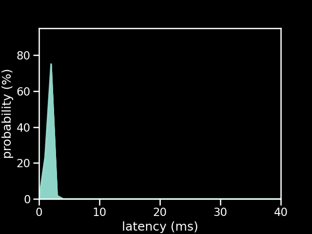

# PS1 Controller connected to a Arduino Uno running the old firmware

| Metric          | Value          |
| --------------- | -------------- |
| firmware        | old            |
| microcontroller | Arduino Uno    |
| controller      | PS1 Controller |
| poll rate       | 1 ms           |
| min             | 1.46 ms        |
| max             | 3.11 ms        |
| avg             | 2.26 ms        |
| stddev          | 0.37 ms        |
| %on time        | 87%            |
| %1f skip        | 13%            |
| %2f skip        | 0%             |
| %3f skip        | 0%             |

[{: class="big-image" }](../../assets/images/results/ardwiino_ps1_uno.png)
