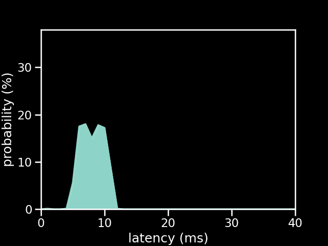

# PS2 SG connected to an Arduino Uno running the old firmware

| Metric          | Value       |
| --------------- | ----------- |
| firmware        | old         |
| microcontroller | Arduino Uno |
| controller      | PS2 SG      |
| poll rate       | 1 ms        |
| min             | 1.77 ms     |
| max             | 12.07 ms    |
| avg             | 8.55 ms     |
| stddev          | 1.75 ms     |
| %on time        | 49%         |
| %1f skip        | 51%         |
| %2f skip        | 0%          |
| %3f skip        | 0%          |

[{: class="big-image" }](../../assets/images/results/ardwiino_ps2_guitar_uno.png)
