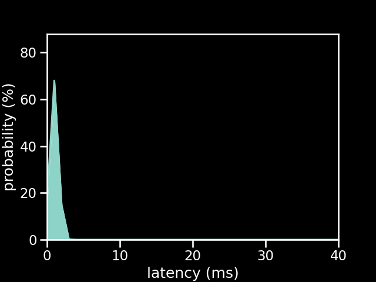

# PS1 Controller connected to a Pro Micro 5v running the new firmware

| Metric          | Value          |
| --------------- | -------------- |
| firmware        | new            |
| microcontroller | Pro Micro 5v |
| controller      | PS1 Controller |
| poll rate       | 1 ms           |
| min             | 0.55 ms        |
| max             | 3.12 ms        |
| avg             | 1.47 ms        |
| stddev          | 0.48 ms        |
| %on time        | 92%            |
| %1f skip        | 8%             |
| %2f skip        | 0%             |
| %3f skip        | 0%             |

[{: class="big-image" }](../../assets/images/results/santroller_ps1_micro_5v.png)
