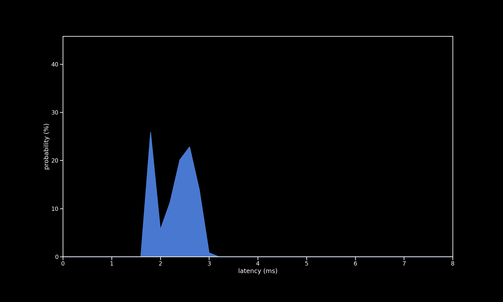

# PS1 Controller connected to a Arduino Uno running the new firmware

| Metric          | Value          |
| --------------- | -------------- |
| firmware        | new            |
| microcontroller | Arduino Uno    |
| controller      | PS1 Controller |
| poll rate       | 1 ms           |
| min             | 2.87 ms        |
| max             | 4.98 ms        |
| avg             | 3.41 ms        |
| stddev          | 0.44 ms        |
| %on time        | 80%            |
| %1f skip        | 20%            |
| %2f skip        | 0%             |
| %3f skip        | 0%             |

[{: class="big-image" }](../../assets/images/results/santroller_ps1_uno.png)
