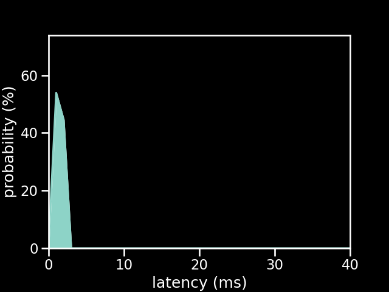

# Wii Classic Controller on a 5v Pro Micro running the old firmware

| Metric          | Value                  |
| --------------- | ---------------------- |
| firmware        | old                    |
| microcontroller | Pro Micro 5v           |
| controller      | Wii Classic Controller |
| poll rate       | 1 ms                   |
| min             | 0.92 ms                |
| max             | 2.93 ms                |
| avg             | 1.91 ms                |
| stddev          | 0.44 ms                |
| %on time        | 89                     |
| %1f skip        | 11                     |
| %2f skip        | 0                      |
| %3f skip        | 0                      |

[{: class="big-image" }](../../assets/images/results/ardwiino_classic_micro_5v.png)
