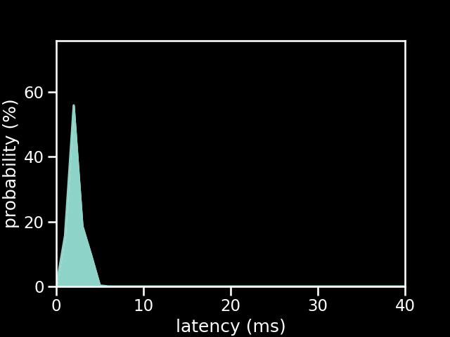

# Wii Classic Controller on an Arduino Uno running the old firmware

| Metric          | Value                  |
| --------------- | ---------------------- |
| firmware        | old                    |
| microcontroller | Arduino Uno            |
| controller      | Wii Classic Controller |
| poll rate       | 1 ms                   |
| min             | 1.4 ms                 |
| max             | 5.36 ms                |
| avg             | 2.74 ms                |
| stddev          | 0.79 ms                |
| %on time        | 84                     |
| %1f skip        | 16                     |
| %2f skip        | 0                      |
| %3f skip        | 0                      |

[{: class="big-image" }](../../assets/images/results/ardwiino_classic_uno.png)
