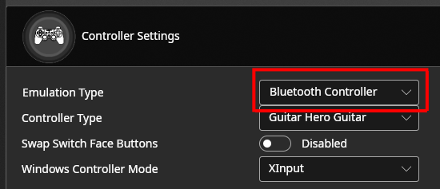

# Bluetooth and Wireless Support
Santroller configurator allows using the Pico W to create wireless guitars. You can use a single Pico W with a PC or phone, or you can use a second Pico W as a bluetooth receiver to get console compatibility.

## Programming a Bluetooth Transmitter
1. Follow the [standard guide](using.html) to set up your inputs.
1. Expand `Controller Settings`, and set the `Emulation Type` to `Bluetooth Controller`    
  
2. Hit Save Settings

## Programming a Bluetooth Receiver
1. Program a Transmitter using the above guide, and keep it plugged into a power source.
2. Plug in your Pi Pico and open the configuration tool. It should show up as an unprogrammed device, if it does not, unplug the Pico, hold bootsel, and plug it back in.
3. Set the `Input Type` to `Bluetooth Receiver` and hit `Configure`
4. Once initial configuration is done, hit `Configure` again.
5. Expand `Controller Settings`, and set the `Controller Type` to the same `Controller Type` used in the transmitter.
6. Expand `Bluetooth Input` and hit `Start Scan`
7. Find your transmitter in the `Selected Device` drop-down, and then hit `Save Settings`