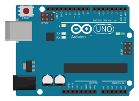
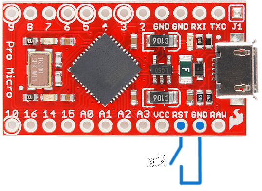
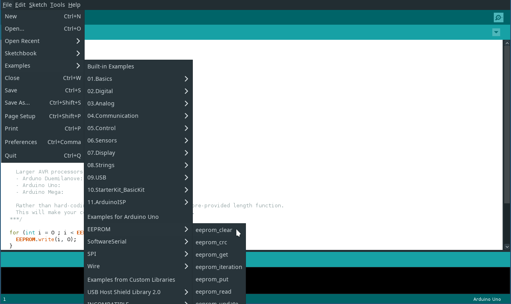
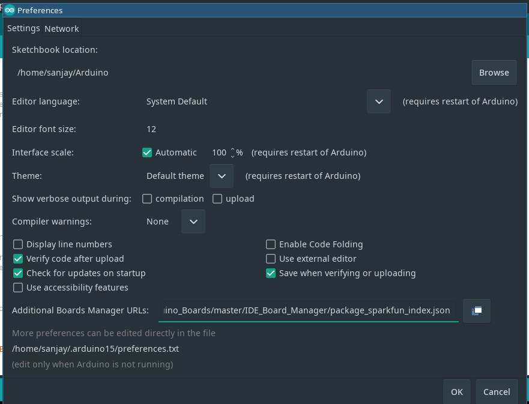
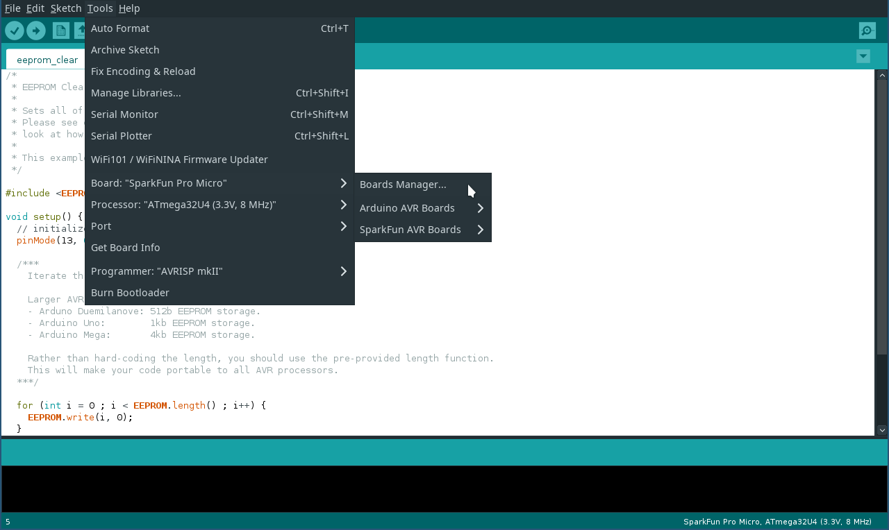
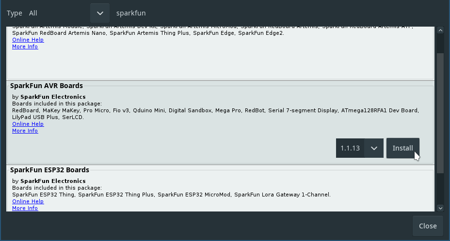
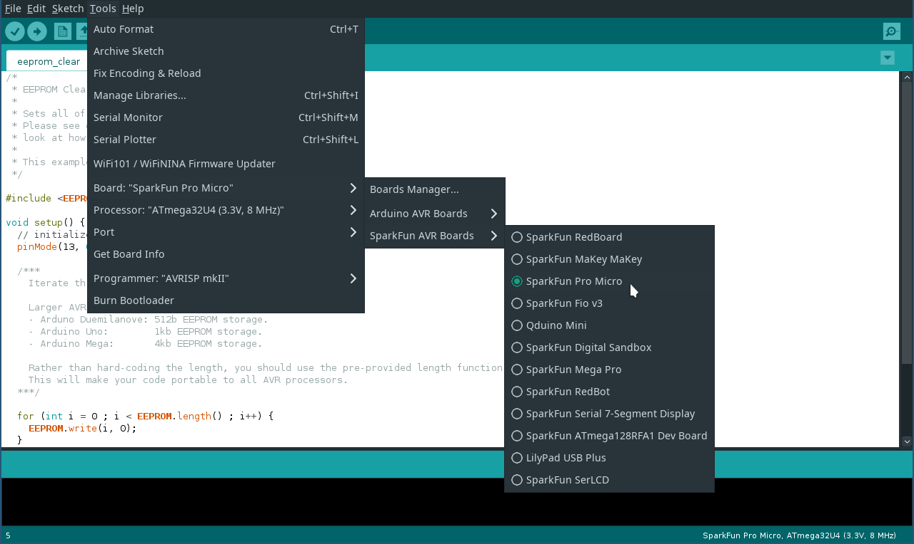
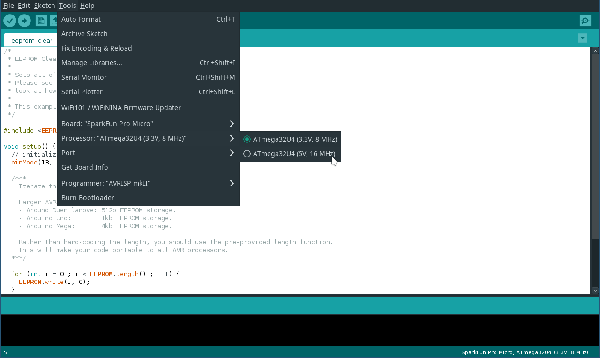
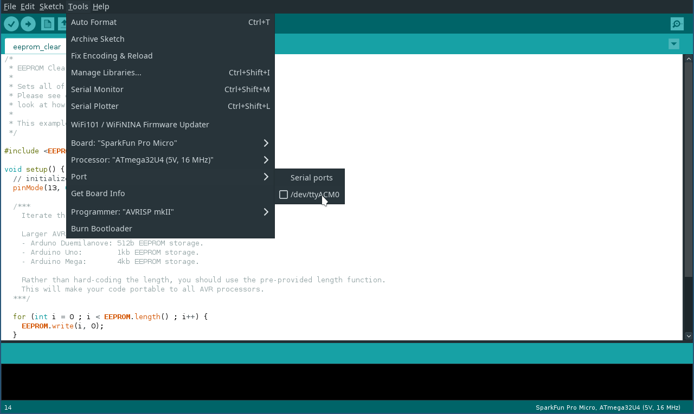
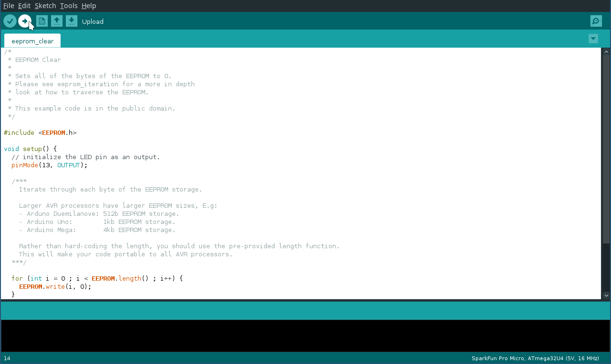

## Device no longer shows up or pushed bad config

The tool has the ability to detect devices in firmware update mode, and offer to fix them back up. For all supported arduinos except the Uno, you can just short reset to GND **twice** to get to this mode and it will stay in firmware update mode for a few seconds. As long as the config tool is open, this should be enough time to reprogram the device. There are a few differences to this (Uno and Pico) as shown below, as well as a guide for if this isn't working for a Pro Micro. (A.K.A. - a bad config was pushed)

# Arduino Uno 
You need to short the following reset pins to get into firmware update mode:

# Pi Pico
Press the BOOTSEL button and hold it while you connect the other end of the micro USB cable to your computer:

# Pro Micro 

Short the rst pin to ground twice in quick succession, and the tool will detect the pro micro in bootloader mode

Note that when this is done, you only get around 8 seconds to reprogram the guitar, so you will need to be quick and its best to open the config tool first.

# Clearing the config on a Pro Micro

1. Install Arduino IDE https://www.arduino.cc/en/software

2. From the file menu, load up the EEPROM clear example sketch, as shown below:

3. Go to file -> preferences -> additional boards manager -> URLs and put in: https://raw.githubusercontent.com/sparkfun/Arduino_Boards/master/IDE_Board_Manager/package_sparkfun_index.json

4. Go to tools -> board -> board manager

5. Search for "sparkfun" and install “SparkFun AVR Boards”

6. Set your Arduino type as SparkFun -> Arduino pro micro

7. Set the processor to the voltage of your arduino

8. With the arduino plugged in, short the rst pin to ground twice in quick succession

9. Quickly pick the serial port that shows up

10. Hit upload
11. Quickly short rst to ground again twice

Note: It is important to hit upload first and then short twice, as the Arduino only stays in it's programmable mode for 8 seconds

