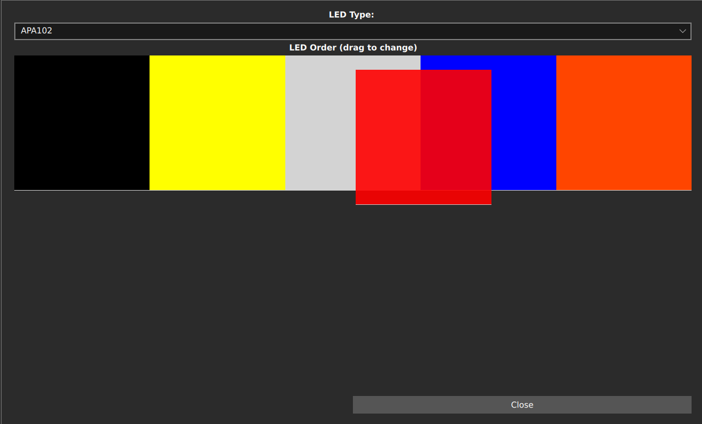

# Adding RGB LEDs to controllers
You can add LEDs that will light up when a button or analogue input is pressed. For people playing Clone Hero, you can also make the frets light up based on in-game events such as Star Power.
## You will need
* A configured wii adaptor or directly wired controller. Note that PS2 controllers are not supported, as they use the same pins as the APA102s.
* Some APA102s (or Dotstar or SK9822 or APA107 or HD107s as these are all compatible / clones of the APA102)
  * Note that if your using JLCPCB, the SK9822 is often available when the APA102 is not.

## The finished product


## Steps
1. Connect the VCC and GND pins on all LEDs that are being used to the Arduino.
2. Connect the SCK (CI) and MOSI (DI) on the first LED to the SCK and MOSI pins on your Arduino. Then chain the SCK (CO) and MOSI (DO) outputs to the inputs on the next LED, until all LEDs are connected.
      
   | Microcontroller | SCK (CI) | MOSI (DI) |
   | --- | --- | --- | --- | --- |
   | Pi Pico | GP6 | GP3 |
   | Pro Micro, Leonardo, Micro | 15 | 16 |
   | Uno, Pro Mini | 13 | 11 |
   | Mega | 52 | 51 | 

3. Open the Config Tool and find your device, then click continue
4. Click on Configure LEDs
5. Set the LED Type to APA102
6. Click Close
7. Now, when configuring, you will have the option to enable LEDs for all inputs. Enable LEDs for the inputs you want to use. 
8. When LEDs are enabled, you can also configure different colours for each input. You will be presented with a colour picker, and the LEDs will change in real time as you change colours.
9.  Click on Configure LEDs
10. You should have a Grid of all of the LEDs you have enabled. From this screen, you can drag and drop different LEDs around, so that the tool knows the order you have chained your leds together in. See the following image:

    [{: width="250" }](../assets/images/drag-led.png)
11. Click on Close
12. Click on Write
