# Building an Adaptor for a Wii Controller
## You will need
* One of the following Arduinos
  * Pi Pico (I recommend this the most, as it is the easiest to get started with and for most people it will be easier to purchase, and it runs at 3.3v so it works for everything.)
  * Arduino Pro Micro (3.3v)
  * Arduino Pro Micro (5v)
  * Arduino Leonardo
  * Arduino Micro
  * Arduino Uno
  * Arduino Mega
```danger
  The arduino nano is NOT supported as it does not have the necessary hardware onboard for emulating a usb device. Some very very cheap arduino unos will also have this problem as they replace the programmable usb controller with a non programmable serial adapter. I don't recommend UNOs at all, but if your arduino uno mentions anything about a ch340g it won't work.
```
* A basic tilt switch (if you want tilt) (sometimes called a Mercury switch or ball tilt switch). 
  * It is recommended to use two, as this can help avoid accidental activations (this is what is done in some offical guitars)  
  * I know some people use the SW-520D (which is a ball tilt switch), I myself just use some mercury tilt sensors that my local electronics shop sells.
  * Make sure that you get a basic tilt sensor and not one with additional electronics, for example, this type of sensor is correct 
    
    [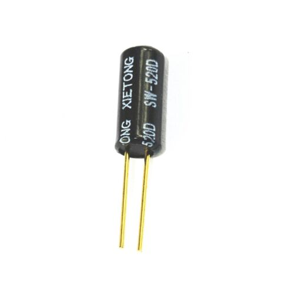{: width="250" }](../assets/images/s-l500.jpg)

```danger
  You do not want to get this type of sensor, as it does not work.
    
  [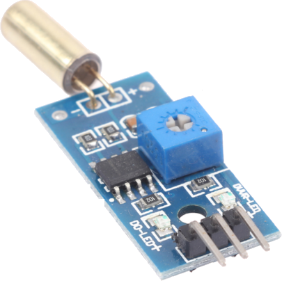{: width="250" }](../assets/images/s-l500.png)
```
```danger
For anyone wanting to use tilt, the only supported method is using digital tilt switches. Support for the MPU-6050 and analog tilt sensors is now deprecated and will be removed from the firmware in a future update. They are causing a lot of issues for porting this code between various microcontrollers, and take up too much space in the firmware.
```
* A Wii extension breakout board or an extension cable, such as [{: width="250" }](https://www.adafruit.com/product/4836). You can also choose to cut the end of the extension and solder your own cables on as well if you perfer.
* If your wii extension breakout does not support 3.3v input, and you are using a 5v pro micro, you will need a 3.3v voltage regulator. The breakout listed above does however support either voltage so this is not required for that breakout.
* Some Wire
* A Soldering Iron

```note
If you are unsure what microcontroller you want to use, click [{: width="250" }](https://sanjay900.github.io/guitar-configurator/guides/micro-controller-comparison.html) for a list of pros and cons about each microcontroller.
```
```danger
note that on the pi pico you need to use the `3v3 out` pin (pin 36)  for your VCC, not 5V or `3v3_en`. The pins on the pico are not rated for 5v, and the `3v3_en` pin is actually an input that will stop your pico from starting.
```
```danger
Be careful that you don't ever provide 5v power to the power pin of a Wii Extension, as they are not designed for this. The data pins however are tolerant of 5v, so you can hook these up directly to pins on your Arduino.
```

```danger
Be careful when programming an Arduino that has multiple variants. If you pick the wrong voltage, your device won't show up and you will need to follow the [{: width="250" }](https://sanjay900.github.io/guitar-configurator/tool/rescuing.html) instructions to make it show up again!
```

## The finished product
[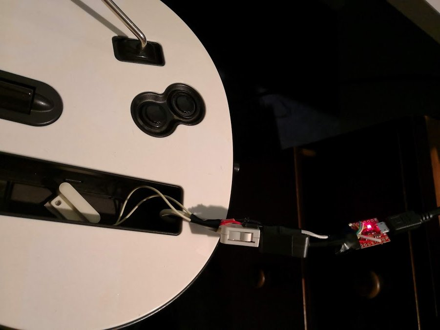{: width="250" }](../assets/images/adaptor.jpg)

## Steps
1. Connect wires between the SDA and SCL pins on your breakout board / wii extension cable. 
Refer to the following image for the pinout of a Wii Extension connector.

    [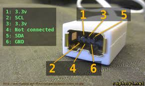{: width="250" }](../assets/images/wii-ext.jpg)
   
   | Microcontroller | SDA | SCL |
   | --- | --- | --- |
   | Pi Pico | GP18 | GP19 |
   | Pro Micro, Leonardo, Micro | 2 | 3 |
   | Uno, Pro Mini | A4 | A5 |
   | Mega | 20 | 21 |

```danger
If you are using a wii extension cable do NOT rely on the colours, the manufacturers are all over the place with this and the only way to validate them is to test each wire according to the above image. I've come across connectors wired with green as ground and black as VCC before, you just can't rely on the colours at all unfortunately.
```
1. Connect the vcc on the microcontroller to the vcc on the breakout
   * If you are using a 5v pro micro, and your breakout does not support 5v input, then you will need to hook up VCC from the arduino to a 3.3v regulator, and then hook up the output of the regulator to the breakout
   * If you are using the arduino uno, use the 3.3v pin on your arduino as VCC
   * If you are using the breakout linked , the `vin` pin is used for both 3.3v input and 5v input. The 3v pin is actually an output and is not needed for this project.
2. Connect the gnd pin on the wii breakout / extension cable to the gnd on your Arduino.
3. If you want tilt, connect the two switches in series between ground and any digital pin that has not already been used.
     * If you want to add LEDs to your guitar, avoid the MISO, MOSI and SCK pins on your Arduino.
       * For an Arduino Pro Micro (3.3v), Leonardo or Micro, the SCK pin is pin 15, the MOSI pin is pin 16 and the MISO pin is pin 14.
       * For an Arduino Uno, pin 11 is MOSI, pin 12 is MISO and pin 13 is SCK.
       * For a Pi Pico, GP3 is MOSI, GP4 is MISO and GP6 is SCK.
4. Start the Ardwiino Configuration Tool
   1. Note if you are on linux, you may need to follow the steps outlined in the  instructions
5. Plug in your Arduino
6. Your Arduino should show up, like in the following image.

    [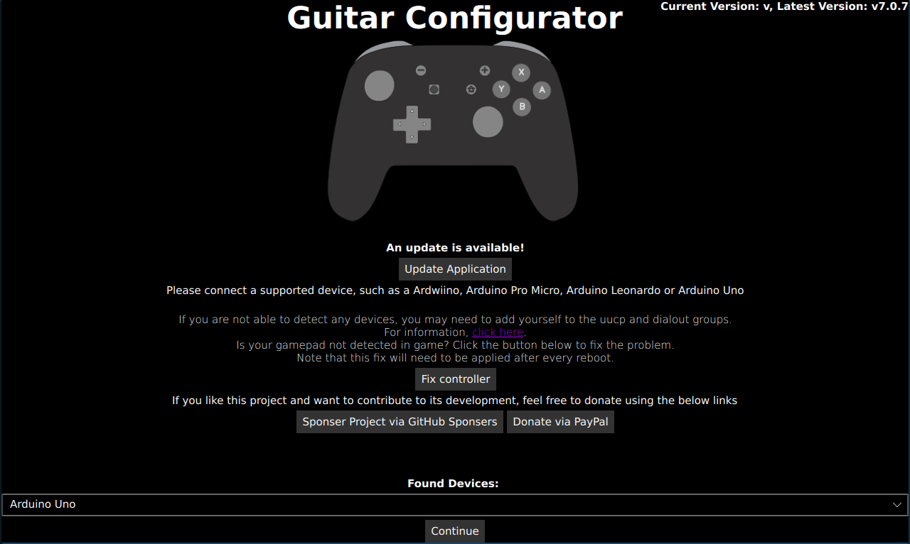{: width="250" }](../assets/images/device-pick-uno.png)
    * Using a Pico and don't see your device? Unplug the pico, hold the bootsel button, and plug it back in.
    
    [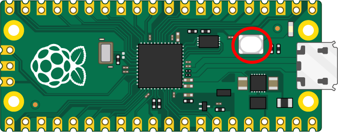{: width="250" }](../assets/images/pico-bootsel.png)

7. Click Continue
8. You will be met with the following screen (Note that it will be slightly different for an Arduino Uno or Arduino Mega)

    [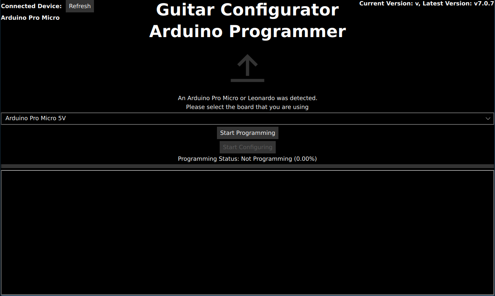{: width="250" }](../assets/images/programming.png)

9.  For the Micro, Leonardo and Pro Micro, please pick the type of device you have in the dropdown. Note that you need to get the voltage right, otherwise your device will not work and will need to be reset.
10. Click `Start programming` and wait for it to program
11. Once it finishes, Click `Start Configuring`
12. You will be taken to following the configuration screen.

    [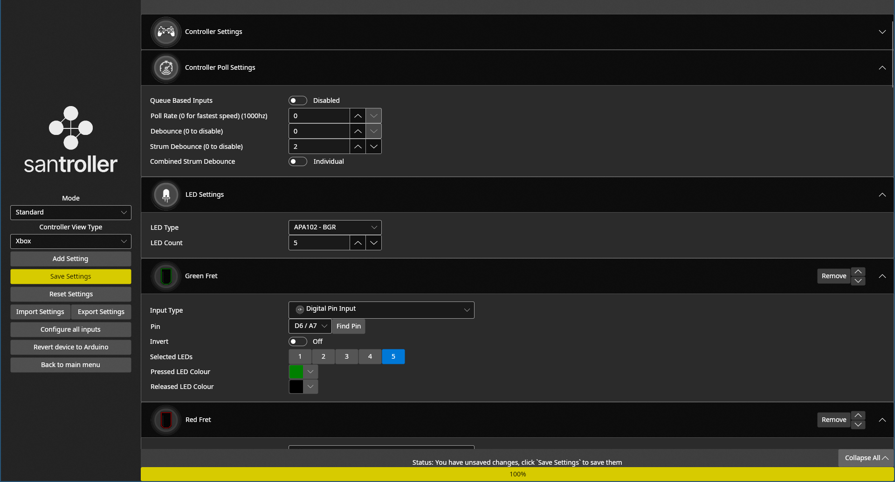{: width="250" }](../assets/images/main-screen-graphical.png)

13. Click on `Change Device Settings`.
14. You will be shown the following dialog:

    [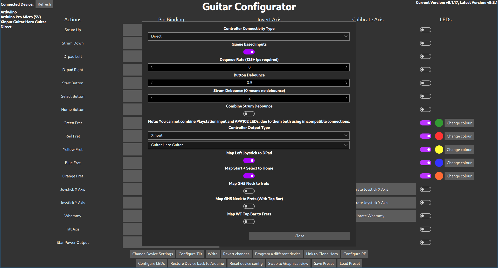{: width="250" }](../assets/images/change-dialog.png)

15. Change `Controller Connectivity Type` to Wii.
    * You can also change the `Controller Output Type` here too if you would like to emulate a different type of controller, such as a drum set, a standard controller or even a controller for a different console, like a PS3 or a Switch.
    * Optionally, enable and configure Queue based inputs. This uncaps the scanning rate on the buttons of the controller (although this will still be limited by the internal Wii circuitry), logging all the button changes to an internal list. The game then receives the next recorded input in the list instead of the immediate button state, which would usually be capped to the Controller Poll Rate. This emulates a higher polling rate even with low in-game FPS, which is extremely useful in games such as Clone Hero. Adjust the Dequeue Rate to be as close to, but still below your expected worst case in-game FPS for the system to work properly.
16. If you would like the Left Joystick (The only Joystick on a Wii Guitar) to act like the DPad, then enable `Map Left Joystick to DPad`
17. If you would like to emulate the Home button by hitting both Start and Select at the same time, then enable `Map Start + Select to Home`
18. Hit Close
19. If you want to enable Tilt, click on Configure Tilt
    1. The following dialog will appear
      
        [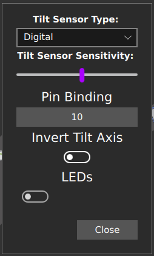{: width="250" }](../assets/images/tilt-dialog.png)

    2. Set the Tilt Sensor Type to digital
    3. Click on the button underneath Pin Binding.
    4. The Pin Configuration Dialog will appear:

       [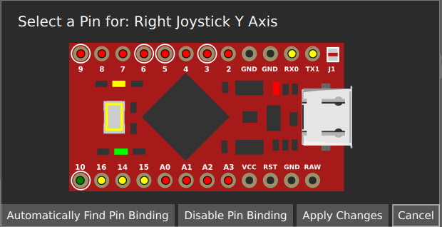{: width="250" }](../assets/images/pin-dialog.png)

    5. You can either click on the pin that you have plugged your tilt into, or use the `Automatically Find Pin Binding` button. You can then just tilt the guitar to activate tilt. Note that for analogue tilt sensors, you just need to pick the pin for the axis of tilt you want to activate your guitar. This will depend on how you have mounted your tilt sensor.
    6. Click `Apply Changes`
    7. Click `Close`
 20. Click `Write`
 21. At this point, your controller should be working, test it using the Windows controller tester or a game controller tester of your choice.
